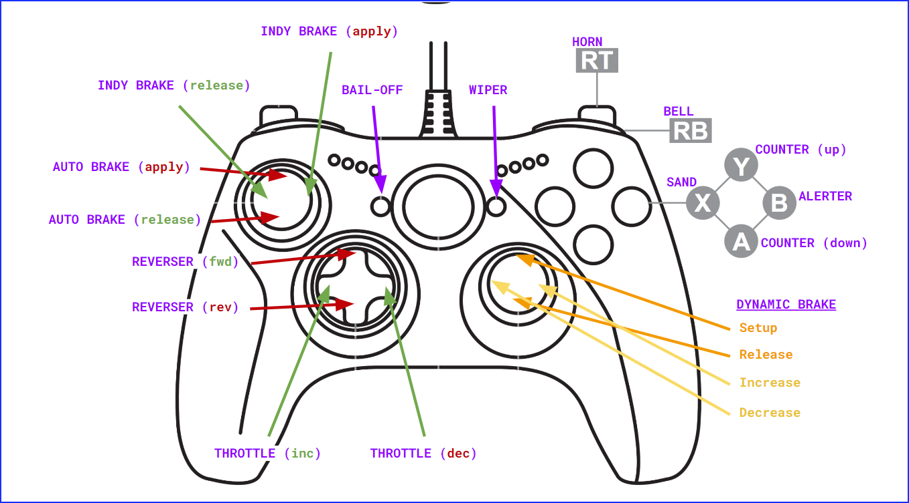

A quick proof-of-concept using a generic X-Box type controller (via the Windows Joystick API) to interface with Run8 via their "Custom USB Controller" interface (UDP)

D-Pad controls reverser : up = fwd, dwn = rev, left = throttle notch up, right = throttle notch down
Left stick controls air : up = auto brake apply, down = auto brake release, right = indy apply, left = indy release
right stick controls dynamic : up/down = in/out of setup, left = less dynamic, right = more dynamic

Various other functions for the buttons and triggers have also been added. See code for now.

Current layout looks like this:

From pygame docs on Xbox 360 controller:
The Xbox 360 controller mapping has 6 axes, 11 buttons and 1 hat. The controller is recognized as "Xbox 360 Controller".

Left Stick:

Left -> Right   - Axis 0
Up   -> Down    - Axis 1
Right Stick:

Left -> Right   - Axis 3
Up   -> Down    - Axis 4
Left Trigger:

Out -> In       - Axis 2
Right Trigger:

Out -> In       - Axis 5
Buttons:

A Button        - Button 0
B Button        - Button 1
X Button        - Button 2
Y Button        - Button 3
Left Bumper     - Button 4
Right Bumper    - Button 5
Back Button     - Button 6
Start Button    - Button 7
L. Stick In     - Button 8
R. Stick In     - Button 9
Guide Button    - Button 10
Hat/D-pad:

Down -> Up      - Y Axis
Left -> Right   - X Axis